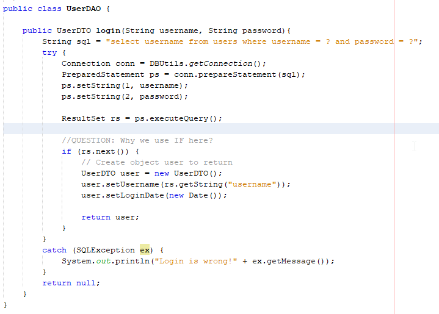
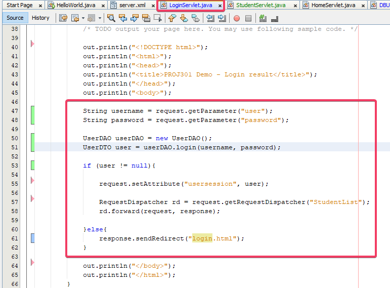
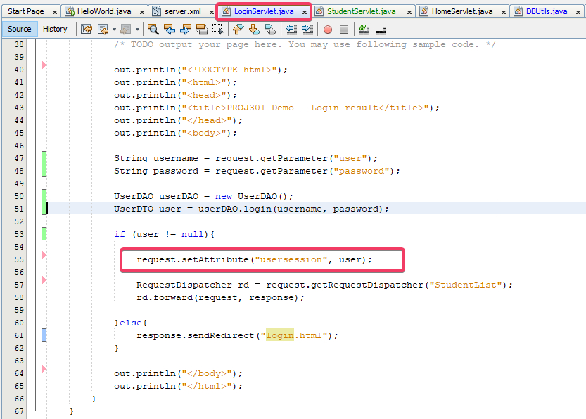
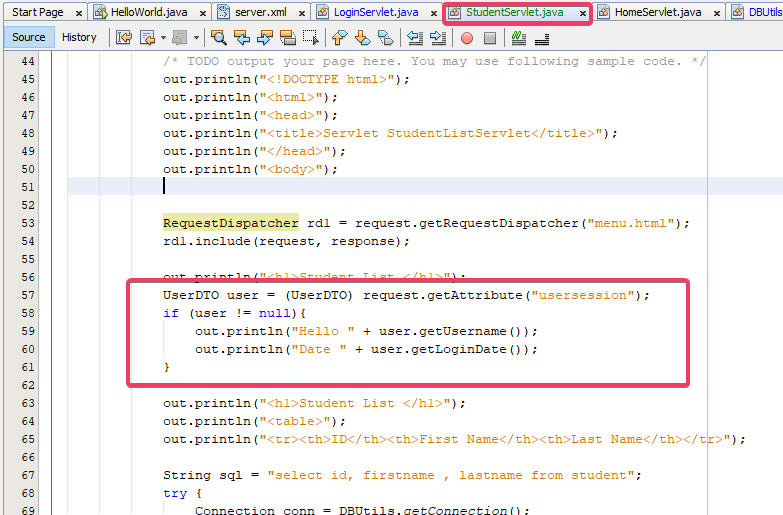
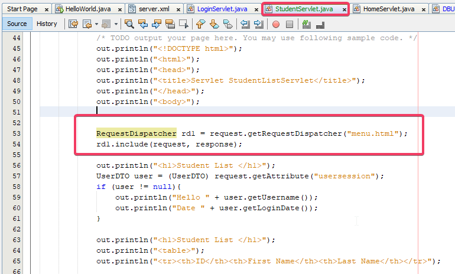

# Exercise 3

## Milestone 12: Develop Login function and direct to Student List page

- Pull the prj301-demo3. 
- Create new table `users` for checking user login

```
USE prj301;
GO
CREATE TABLE users (
    username VARCHAR(100) PRIMARY KEY,
    name VARCHAR(100),
    password VARCHAR(30)
    
);

INSERT users (username, password, name) VALUES
('dung','dung','Huynh Dung');

INSERT users (username, password, name) VALUES
('nam','nam','Nguyen Nam');
```

- Develop UserDAO and UserDTO to query database for login. 



- Use the method UserDAO.login in LoginServlet to check username/password. If the username/password is correct, forward to page StudentList. If not, redirect to page login.html



- Show username in StudentList using attribute





- Include menu for page StudentList



- SUBMIT YOUR SCREENSHOTS:  
	12.1 UserDAO.java  
	12.2 LoginServlet.java  
	12.3 Page StudentList with current user and menu  

## Milestone 13: Develop StudentDAO and StudentDTO

- Create a new package com.fptuni.prj301.demo.Student and two classes StudentDAO and StudentDTO

- Create attributes of StudentDTO, setter and getter

```
private Long id = null;
private String firstName = null; 
private String lastName= null;
```

- In StudentDAO, develop method `list` which query students in database

```
public List<StudentDTO> list(String keyword ){
        
        ArrayList<StudentDTO> list;
        list = new ArrayList<StudentDTO>();
        
		// your code
		//

		while (rs.next()){
        	list.add(new StudentDTO (
					rs.getLong("id"),
					rs.getString("firstname"),
					rs.getString("lastname")
			);
        }

		// your code
		//


        return list;
}
```

- In StudentServlet, using StudentDAO.list to print Student table.

- SUBMIT YOUR SCREENSHOTS:  
	13.1 StudentDAO.java  
	13.2 StudentDTO.java  
	13.3 StudentListServlet.java  
	13.4 Page StudentList with current user and menu  


