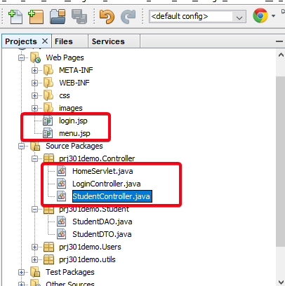
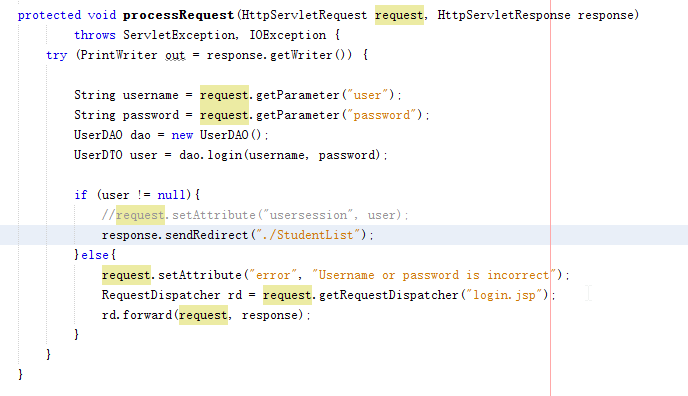
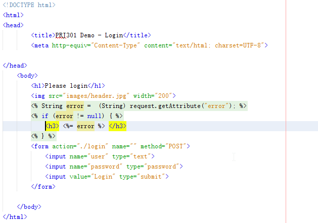
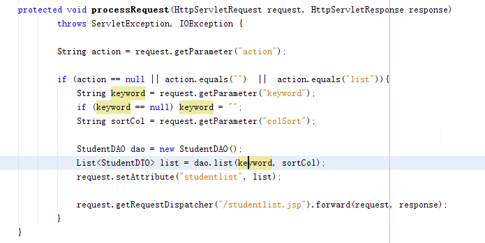
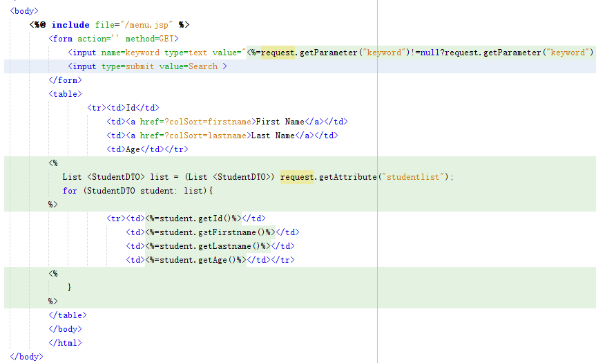

# Exercise 4

## Milestone 14: Implement MVC for Login function

1. Pull the prj301-demo4. 
2. Review the code to see the changes of filenames:
	- login.html is changed to login.jsp
	- XXServlet is change to XXController
	

	
3. Develop the LoginController which check username and password. If username and password are correct, **REDIRECT** to `/student` (StudentController), else **FORWARD** to `login.jsp` 

4. The `login.jsp` gets the error from LoginController to show in Login form.

5. Take all screenshots of your code and demostration

## Milestone 15: Implement MVC for Student function

1. Implement file StudentController which check parameter `action`, if `action` is `list`, retrieve Student list and transfer to `studentlist.jsp`

2. Implement file studentlist.jsp to render the student list

3. Take all screenshots of your code and demostration

