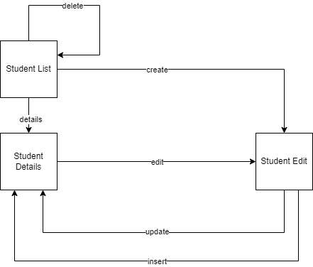
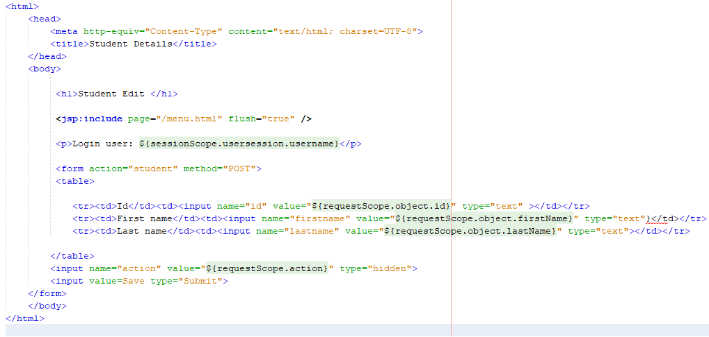
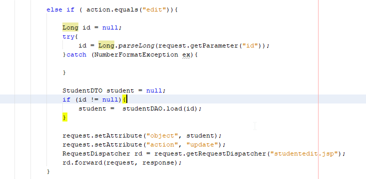
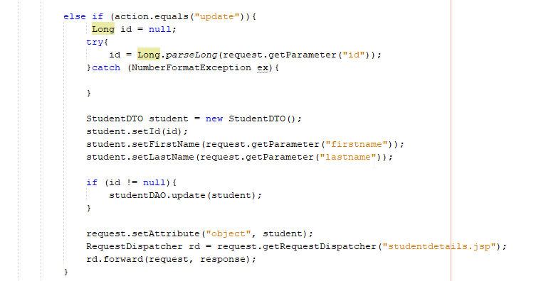

# Exercise 5

**Objective:**

- Students understand how to create CRUD application.
- Students practise JSP, EL

**Features of Student Management System**

- Full features for CRUD application

**Review**

Look at the following diagram to understand how the action works between screens in the controller.

Students pull code from GitHUb `prj301-demo5` and review the controller to understand how the system works.

## Milestone 16: 

1. Develop the the function `update` student student in StudentDAO.java 

2. Create and Edit the `studentedit.jsp`. Develop a form to edit student.

3. Update Student Controller  to process `edit` action and `update` action

4. Take screenshots of your browser and your code.

## Milestone 17:

1. Develop the the function `delete` student in StudentDAO.java 

2. Update Student Controller  to process `delete` action

3. Take screenshots of your browser and your code.

## Milestone 18: 

1. Develop the the function `insert` student student in StudentDAO.java 

2. Update Student Controller  to process `create` action and `insert` action

3. Take screenshots of your browser and your code.
